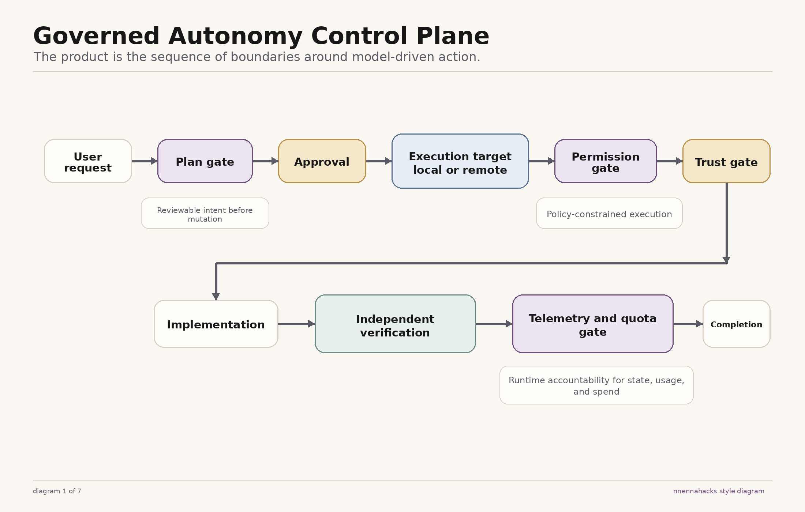

# Governed Agent Autonomy Patterns

AI coding systems need a control plane, not just a better model.

This repo is a public, docs-first reference for teams that want agentic coding without chaos. It focuses on the five gates that protect code integrity while still preserving speed: `plan`, `permission`, `tool trust`, `verification`, and `runtime accountability`.

The core reframe is simple: boundaries are not bottlenecks. Good boundaries are how teams get sustainable velocity.

## Why this repo exists

Most discussion about AI coding systems still centers on generation speed. That misses the harder problem. The risk is not that agents can write code quickly. The risk is that they can write and execute changes quickly without enough planning, review, verification, trust controls, and runtime accountability.

This repo packages a reusable framework for evaluating and designing governed agent autonomy. It is meant to be easy to repurpose into:

- talk and workshop material
- blog posts and teardown pieces
- internal platform standards
- procurement and evaluation checklists
- lightweight team rollout guides

The same control-plane logic applies after code generation too. Packaging and publish workflows are part of code integrity, not a separate concern.

## The Five Gates

| Gate | Purpose | Core question |
| --- | --- | --- |
| `plan` | Separate exploration from execution | Can the system pause, inspect, and propose before it mutates code? |
| `permission` | Gate risky actions with explicit policy | Can the system distinguish safe, risky, and disallowed behavior? |
| `tool trust` | Review risky tools and settings before enablement | Are external capabilities explicitly approved before the agent can rely on them? |
| `verification` | Keep implementation and validation independent | Does a separate verifier produce evidence instead of self-grading? |
| `runtime accountability` | Make execution state, usage, and spend governable | Can operators see what the system is doing, where it is running, and what it is costing while it runs? |

Visibility still matters, but it is not a floating concept here. In this repo, visibility becomes operational through the runtime accountability gate: execution state, traceability, quota decisions, cost attribution, and audit surfaces that let operators supervise autonomous work.

## Architecture At A Glance

In the visual set, the fifth gate is rendered as a telemetry and quota gate. In this repo, that control surface is named `runtime accountability` because it governs state, usage, spend, and threshold-based intervention together.

This control plane keeps generation power inside explicit operational boundaries. The point is not to stop work. The point is to make safe work easy and unsafe work obvious.

See the [diagrams](docs/diagrams.md) page for the supporting visual set and portable mermaid versions.

## How To Use This Repo

If you are an engineering leader:

- use the [scorecard](docs/scorecard.md) to evaluate tools or internal platforms
- use the [diagrams](docs/diagrams.md) to explain why controls accelerate safe adoption
- use the gate pages to define rollout expectations for teams

If you are a platform or developer tooling team:

- start with the [gate pages](docs/patterns/plan.md)
- review [runtime accountability](docs/patterns/runtime-accountability.md) if you operate remote or budgeted workflows
- review the [governed publish pipeline](docs/applications/governed-publish-pipeline.md) if you own release automation
- copy the [examples](examples/plan/planning-prompt.md) into internal docs or prototypes
- adapt the scorecard into design review gates or vendor questionnaires

If you are a practitioner or staff engineer:

- use the gate docs as a checklist for what to demand from agentic workflows
- use the examples as a starting point for policy files, verifier contracts, approval records, and runtime-accountability templates

## What’s In Here

- [Scorecard](docs/scorecard.md): evaluate integrity support instead of speed alone
- [Diagrams](docs/diagrams.md): portable visuals for talks, posts, and internal docs
- [Plan gate](docs/patterns/plan.md): pre-mutation planning and explicit approval
- [Permission gate](docs/patterns/permission.md): allow, ask, deny, and dangerous overrides
- [Tool trust gate](docs/patterns/tool-trust.md): explicit approval for external tools and risky settings
- [Verification gate](docs/patterns/verification.md): independent validation with evidence
- [Runtime accountability gate](docs/patterns/runtime-accountability.md): execution-state visibility, quota checks, and spend attribution
- [Runtime accountability templates](examples/runtime-accountability/execution-state-record.md): copyable records for execution state, threshold rules, cost attribution, and overage approval
- [Governed publish pipeline](docs/applications/governed-publish-pipeline.md): apply the framework to packaging and release workflows
- [Examples](examples/plan/planning-prompt.md): copyable templates and tiny dependency-free demos

## Source Methodology

The examples and receipts in this repo are adapted from a private production codebase. They are deliberately trimmed, lightly renamed, and annotated for teaching value. The goal is not to publish a hidden product. The goal is to surface the control-plane patterns that matter.

Each adapted excerpt is marked with this note:

> Adapted from a private production codebase; trimmed and renamed for clarity.

## Reading Paths

If you want a quick evaluation path:

1. Read the [scorecard](docs/scorecard.md).
2. Skim the [diagrams](docs/diagrams.md).
3. Go deeper on the weakest gate in your current workflow.

If you want an implementation path:

1. Start with [plan](docs/patterns/plan.md).
2. Add [permission](docs/patterns/permission.md).
3. Add [tool trust](docs/patterns/tool-trust.md).
4. Add [verification](docs/patterns/verification.md).
5. Add [runtime accountability](docs/patterns/runtime-accountability.md).
6. Apply the same controls to packaging and release with the [governed publish pipeline](docs/applications/governed-publish-pipeline.md).

If you want material to repurpose:

1. Pull the control-plane diagram from [diagrams](docs/diagrams.md).
2. Pull the evaluation criteria from the [scorecard](docs/scorecard.md).
3. Pull one adapted receipt from each gate page.

## Repurposing Guide

This repo is structured so the same core material can be lifted into multiple formats with minimal rewriting.

- `README` becomes a talk opening, landing page, or long-form article backbone.
- `scorecard` becomes a buyer guide, internal rubric, or platform review worksheet.
- `diagrams` become presentation slides, blog visuals, or onboarding illustrations.
- `gate pages` become policy docs, team standards, or technical teardown sections.
- `examples` become copyable templates for pilots and internal prototypes.

## Design Principle

Agentic coding systems should not be judged only by how much code they can produce. They should be judged by whether they help teams preserve code integrity while moving quickly enough to matter.
