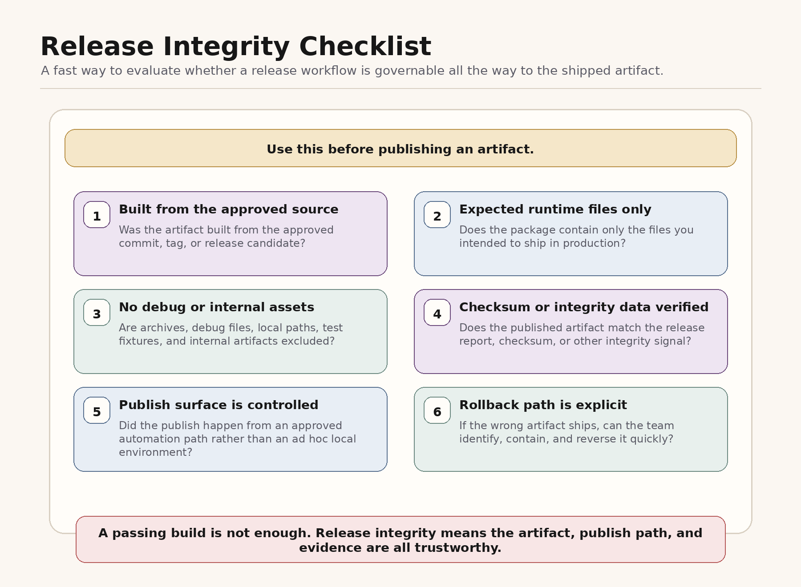

# Governed Publish Pipeline

Packaging and publish workflows are part of code integrity.

The wrong lesson from a release incident is "automate more." That is too vague to help. The right lesson is to govern the publish path so unsafe artifact states cannot ship.

This page shows how the repo's five core gates apply to package release.

A high-level visual of that release path lives below.

In the release visual, `telemetry` is the runtime-accountability gate applied to publish results, provenance, and release-state visibility.

A visual version of the release checklist lives below.

## Why This Matters

Teams often build better controls around code generation than around packaging. That leaves a gap. A system can plan well, code carefully, and still ship the wrong artifact if the release path is manual, opaque, or weakly verified.

The goal is not to remove humans from the loop. The goal is to move humans to the right part of the loop:

- humans approve intent and review evidence
- machines enforce packaging, publish, and verification invariants

## The Five Gates Applied To Publish

### 1. Plan

Release should start with an approved plan, not an ad hoc publish command.

- identify the package, version, registry target, and source commit
- name the expected artifact and rollback path
- approve the release plan before any publish job runs

### 2. Permission

Publish is a privileged action and should be policy-bound.

- allow publish only from CI or another controlled surface
- deny local or wrapper-based publish paths by default
- require artifact inventory checks before the publish step can proceed

### 3. Tool Trust

Release tooling changes can quietly expand risk.

- review packaging config before it takes effect
- review registry-target, credential, and signing-path changes explicitly
- record approval decisions so later incident review can reconstruct the trust boundary

### 4. Verification

Verification should focus on the built and shipped artifact.

- inspect the package contents before publish
- fail if unexpected files, debug assets, or internal paths appear
- re-fetch the published package and compare it to the approved artifact

### 5. Runtime Accountability

Release should stay inspectable after publish starts and after the artifact ships.

- record publish result, artifact provenance, and rollback handle
- surface release-state changes and approval history clearly
- require explicit alert, approval, or stop behavior when release or cost thresholds are crossed

## Minimal Governed Publish Flow

1. Create a release plan from a clean tag or release commit.
2. Build the artifact in CI from a reproducible environment.
3. Generate an artifact inventory and checksum.
4. Review the release report and approve or block publish.
5. Publish through a controlled service account.
6. Re-fetch the published artifact and verify it matches the approved artifact.
7. Store the approver, checksum, provenance, publish result, and rollback handle in an audit record.
8. Alert, stop, or require approval when release or cost thresholds are crossed.

## Common Failure Modes

- A developer publishes locally from an environment no one else can inspect.
- The package contents are treated as an implementation detail rather than a release surface.
- Release automation exists, but artifact inspection is optional.
- Registry or credential changes expand trust without explicit review.
- Teams verify source code quality but never verify the actual shipped package.
- A shipped artifact cannot be traced back to a release record, approval record, or provenance signal afterward.

## What To Copy First

- Use the [release manifest template](../../examples/release/release-manifest-template.md) to define release intent.
- Use the [artifact inventory checklist](../../examples/release/artifact-inventory-checklist.md) before publish.
- Use the [publish approval record](../../examples/release/publish-approval-record.md) to make approval explicit.
- Use the [post-publish verification report](../../examples/release/post-publish-verification-report.md) to capture evidence.
- Adapt the [publish policy example](../../examples/release/publish-policy.example.yaml) into your own release controls.

## Related Reading

- [Scorecard](../scorecard.md)
- [Plan gate](../patterns/plan.md)
- [Permission gate](../patterns/permission.md)
- [Tool trust gate](../patterns/tool-trust.md)
- [Verification gate](../patterns/verification.md)
- [Runtime accountability gate](../patterns/runtime-accountability.md)
