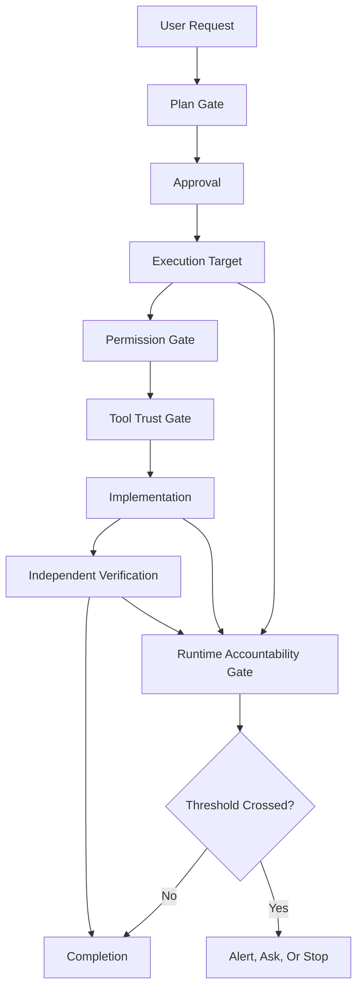
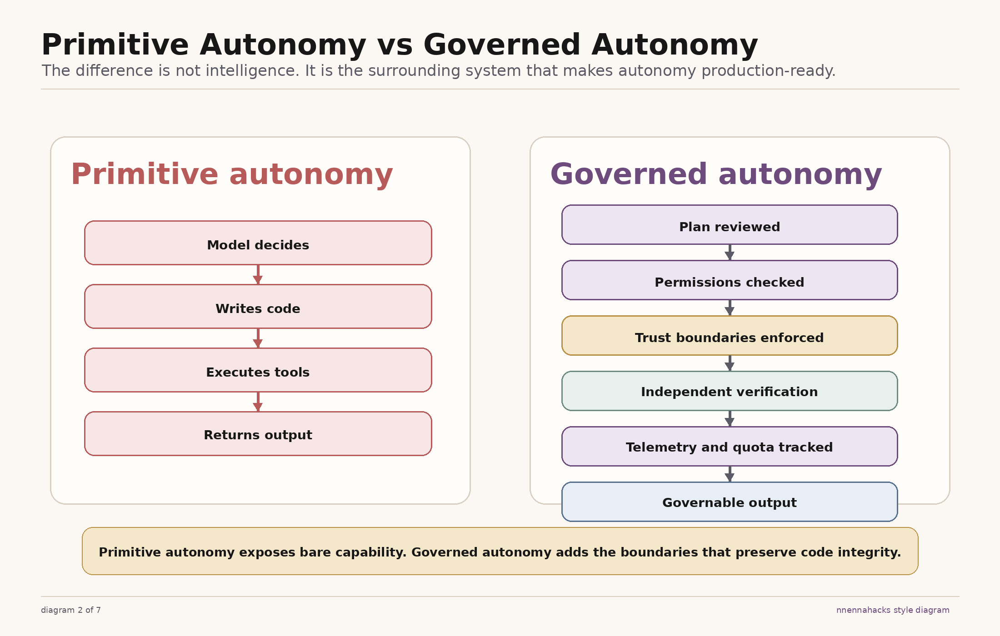
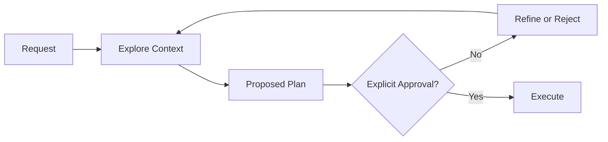
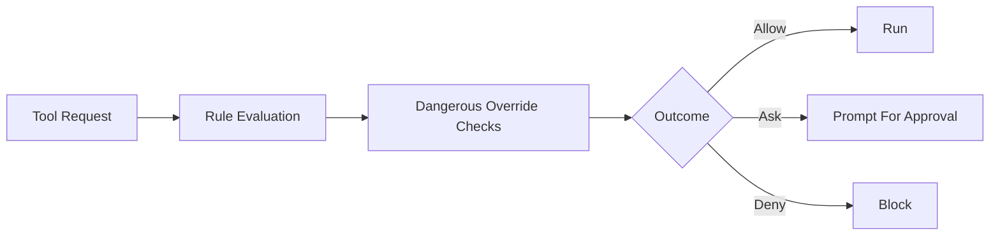
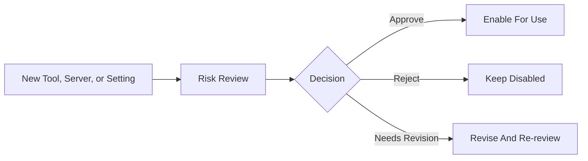
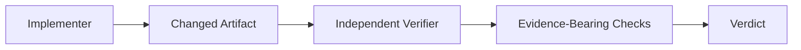
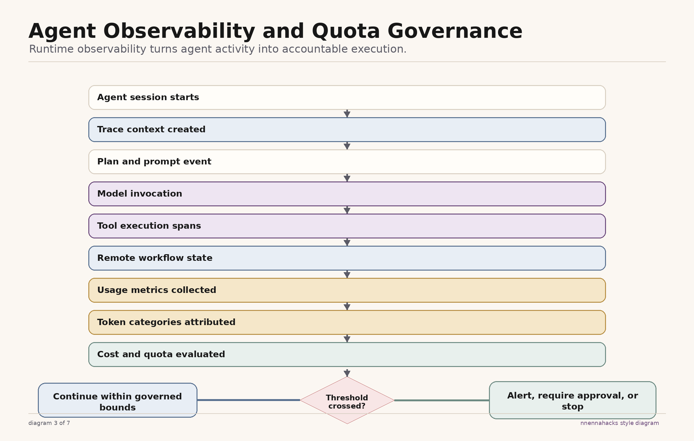
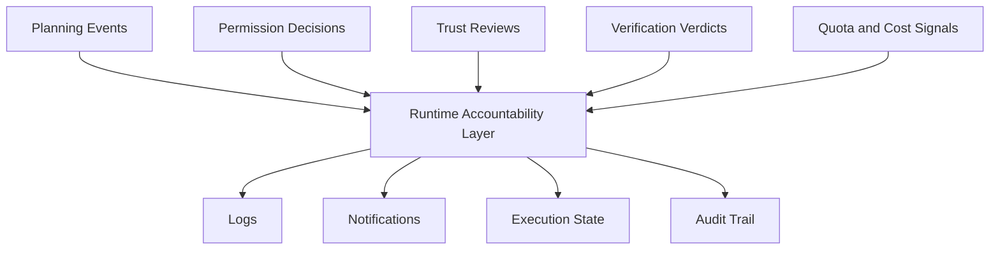
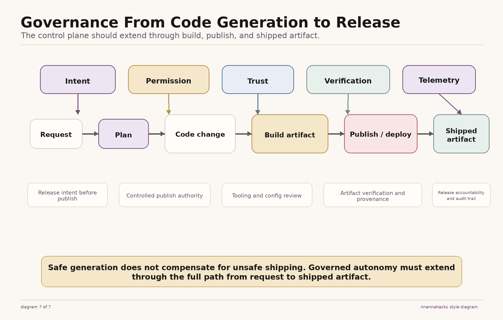
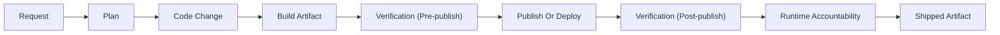

# Governed Agent Autonomy Diagrams

## Control Plane Overview

This diagram shows the full five-gate control plane: planning, permission, tool trust, verification, and runtime accountability all sit between the operator and raw execution power.

In the visual set, the fifth gate is rendered as a telemetry and quota gate. In the repo taxonomy, that gate is called `runtime accountability`.

Portable mermaid version:

## Primitive vs Governed Autonomy

This comparison makes the core reframe explicit: the difference is not intelligence alone. It is the surrounding system that turns capability into something governable.

## Plan Flow

This diagram shows that the planning path exists to delay mutation until the system has inspected context and a human has approved the proposed path.

## Permission Flow

This diagram shows why safe defaults matter: rule matching alone is not enough when dangerous operations need a harder stop.

## Tool Trust Flow

This diagram shows that new servers, tools, and risky settings should not become trusted just because they exist.

## Verification Flow

This diagram shows the separation between implementation and verification. The verifier is a different role with a different job.

## Runtime Accountability Gate

This diagram shows the runtime-accountability layer around agent execution: trace context, model and tool events, usage collection, quota evaluation, and policy decisions when thresholds are crossed.

Supporting mermaid version:

## Governed Publish Pipeline

This diagram shows how the same five gates apply to package release. The publish path should be reviewable, policy-bound, artifact-aware, independently verified, and operationally accountable after publish.

In the release visual, `telemetry` is the runtime-accountability gate applied to shipped artifacts, provenance, and release-state visibility.

Portable mermaid version:

