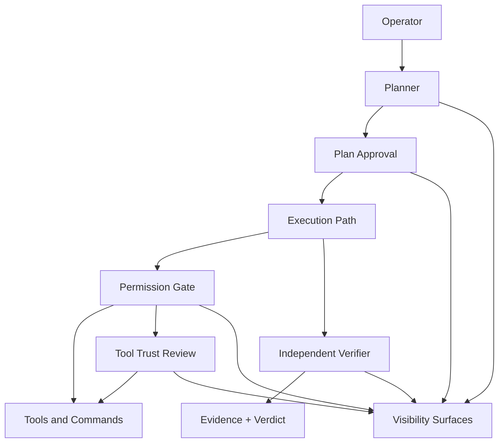
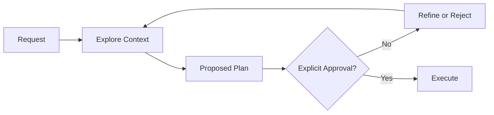
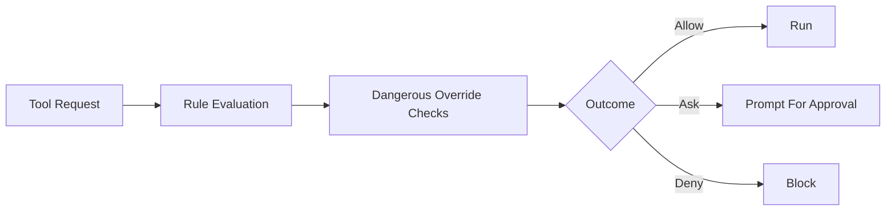
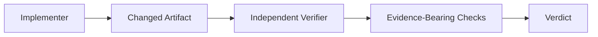
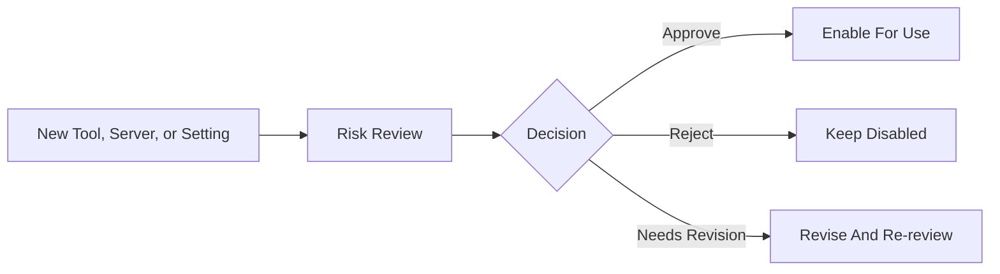
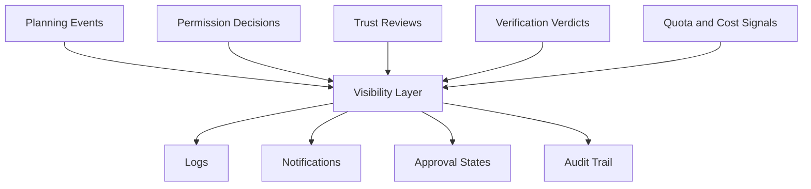

# Governed Agent Autonomy Diagrams

## Control Plane Overview

This diagram shows the full control plane: planning, permissioning, trust review, verification, and visibility all sit between the operator and raw execution power.

## Plan Flow

This diagram shows that the planning path exists to delay mutation until the system has inspected context and a human has approved the proposed path.

## Permission Flow

This diagram shows why safe defaults matter: rule matching alone is not enough when dangerous operations need a harder stop.

## Verification Flow

This diagram shows the separation between implementation and verification. The verifier is a different role with a different job.

## Tool Trust Flow

This diagram shows that new servers, tools, and risky settings should not become trusted just because they exist.

## Cross-Cutting Visibility Map

This diagram shows the surfaces that keep the whole control plane observable. Without these, even good controls become hard to trust.

