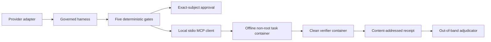

# Governed Coding-Agent Harness

This package is the runnable coding-agent example for the five gates in this
repository. The harness owns the loop. OpenAI and Anthropic adapters translate
provider messages, but they cannot execute tools, approve requests, advance the
lifecycle, verify work, or declare success.



The implementation uses the frozen BoundaryBench evaluator for every gate
decision and exposes only five repository tools:

- `repo.list`
- `repo.read`
- `repo.apply_patch`
- `repo.run`
- `repo.diff`

`repo.run` takes an executable, argument array, and working directory. It never
accepts shell text. Node and npm commands execute in a disposable copy of the
current workspace, so test-side writes cannot mutate the governed source;
read-only `git status` and `git diff` inspect the real workspace. The MCP process
and task run in a container with networking disabled, a read-only root
filesystem, no Linux capabilities, a non-root user, and fixed CPU, memory, and
PID limits. Provider keys stay in the host process.
Verifier-only tests are mounted into separate clean containers and are never
available to the task or MCP process.

## What the harness enforces

The lifecycle is:

```text
created → preparing → planning → awaiting_approval → executing → verifying → terminal
```

A model response cannot advance it directly. The first source mutation
receives all four pre-execution decisions, completion receives an
exact-workspace verification decision, and later protected actions are
re-evaluated. Approvals bind the run, task, subject digest, scope, actor, policy
rule, and event position. Changed capability digests invalidate prior trust.
Missing usage fails closed. Cleanup failure changes the terminal result to
`infrastructure_failed`.

Each receipt contains lifecycle events, challenge decisions, approvals,
redacted provider-visible inputs and outputs, raw provider usage fields,
attributed cost, patch and workspace digests, verifier and adjudicator evidence,
cleanup status, and a digest over the complete receipt. It does not request or
persist hidden reasoning.

## Test without provider calls

From the repository root:

```bash
npm ci --ignore-scripts
npm run build
npm run test:harness
npm run typecheck
```

The fake-model end-to-end suite proves the governed condition and each
one-gate record-only condition without API keys. The real stdio MCP transport is
also exercised locally. Docker integration runs when both variables are
present. The task image must contain both Node 20 and Git:

```bash
docker pull node:20-bullseye
export BOUNDARYBENCH_DOCKER_TEST=1
export BOUNDARYBENCH_DOCKER_IMAGE="$(
  docker image inspect node:20-bullseye \
    --format '{{index .RepoDigests 0}}'
)"
npm run test:harness
```

## Interactive demonstration

Build first, set one provider key on the host, and use an immutable Node 20
image reference:

```bash
export GOVERN_DOCKER_IMAGE='node@sha256:<resolved-digest>'
npm run govern-agent -- doctor --provider openai

export BOUNDARYBENCH_LIVE=1
npm run govern-agent -- run \
  --task capture-idempotency \
  --provider openai \
  --approval interactive
```

The operator must type `approve <exact digest>` for each approval. Interactive
decisions are recorded as `interactive-operator` and are excluded from the
batch experiment. Evidence is written under the ignored `.boundarybench/`
directory.

No live provider call is made by build, test, type-check, or CI.

## Source and claim boundary

Implementation decisions and primary sources are recorded in
[`docs/research/governed-harness-primary-sources.md`](../../docs/research/governed-harness-primary-sources.md).
This package demonstrates enforceable protocol mechanics. It is not, by itself,
evidence of general AI safety, production security, provider superiority, or
real-world reliability.
